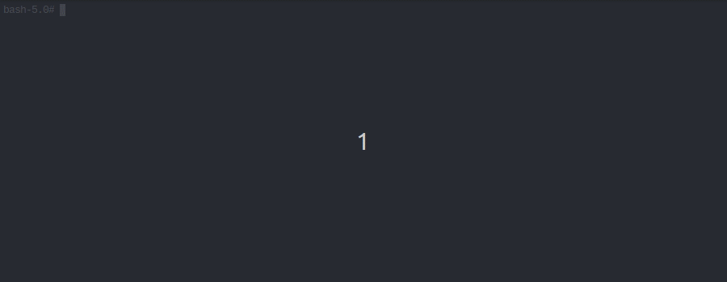

<p align="center">
  <big><strong>Cardano Addresses</strong></big>
</p>

<p align="center">
  <a href="https://github.com/IntersectMBO/cardano-addresses/releases"></a>
  <a href="https://IntersectMBO.github.io/cardano-addresses/coverage/hpc_index.html"></a>
  <br />
</p>

<div align="center">

  <a href="">[](https://github.com/IntersectMBO/cardano-addresses/actions/workflows/style.yml)</a>
  <a href="">[](https://github.com/IntersectMBO/cardano-addresses/actions/workflows/haskell.yml)</a>
  <a href="https://docusaurus.io/"></a>

</div>


## Overview

This module provides mnemonic (backup phrase) creation, and conversion of a
mnemonic to seed for wallet restoration, and address derivation functionalities.



## Documentation

### Haddock documentation

Haddock API documentation is available [here](https://IntersectMBO.github.io/cardano-addresses/haddock/index.html).

### Docusaurus-powered documentation

<a href="https://docusaurus.io/">Powered by </a>

## Supported platforms

CLI documentation is available [here](https://IntersectMBO.github.io/cardano-addresses)

cardano-addresses comes with CLI for Linux, MacOS and Windows. See [releases](https://github.com/IntersectMBO/cardano-addresses/releases) to get respective pre-compiled binaries. There is also straightforward way to build Docker image.

## Building/testing from source using nix

``` console
nix develop

# building
cabal build all

# testing
cabal test cardano-addresses:unit

# installing executable locally
cabal install cardano-address
```

## Override command for cross-compilation

We have now fixed cross-compilation (from Linux to Windows) by replacing runtime `git` call in `System.Git.TH` with CPP macro (ie., `GITREV`) defaulting to "unknown" but allowing overriding via `-DGITREV` as below:

```console
cabal build all --ghc-option=-DGITREV=\"$(git rev-parse HEAD)\"
```

## Preparation steps before uploading to hackage

``` console
cabal build all
cabal haddock
cabal sdist
```

Note: Make sure proper version is set in cardano-addresses.cabal

## Docker Image

Please make sure you have [just](https://github.com/casey/just) installed as `justfile` is used for building Docker image.

### Build

```console
just clean-build-docker
```

### Run

Use the auto-remove flag `--rm` when running commands.

```console
docker run --rm cardano-address recovery-phrase generate --size 15
```

Use the interactive flag `-i` when piping stdin:

```console
echo "addr1gqtnpvdhqrtpd4g424fcaq7k0ufuzyadt7djygf8qdyzevuph3wczvf2dwyx5u" | docker run --rm -i cardano-addresses address inspect
```

## Javascript support

Javascript support was discontinued and dropped. One could look at the following now:

1. [MeshJS](https://github.com/MeshJS/mesh)
2. [blaze-cardano](https://github.com/butaneprotocol/blaze-cardano)

Alternatively one could lean back on release [3.9.0](https://github.com/IntersectMBO/cardano-addresses/releases/tag/3.9.0) where Javascript was still present.

## Docs generation

The README.md is generated from this file using:
```
just generate-readme
```

## Contributing

Pull requests are welcome.

When creating a pull request, please make sure that your code adheres to our [coding standards](https://input-output-hk.github.io/adrestia/code/Coding-Standards).
<hr />

<p align="center">
  <a href="https://github.com/IntersectMBO/cardano-addresses/blob/master/LICENSE"></a>
</p>

