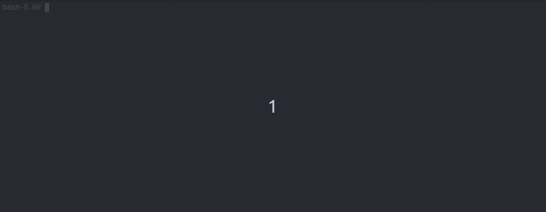

<p align="center">
  <big><strong>Cardano Addresses</strong></big>
</p>

<p align="center">
  <a href="https://github.com/IntersectMBO/cardano-addresses/releases" rel="nofollow"></a>
  <a href="https://IntersectMBO.github.io/cardano-addresses/haddock/index.html" rel="nofollow"></a>
  <a href="https://IntersectMBO.github.io/cardano-addresses/hpc_index.html" rel="nofollow"></a>
  <a href="https://intersectmbo.github.io/cardano-addresses/intro/" rel="nofollow"></a>
  <br />
</p>

<div align="center">

  <a href="">[](https://github.com/IntersectMBO/cardano-addresses/actions/workflows/style.yml)</a>
  <a href="">[](https://github.com/IntersectMBO/cardano-addresses/actions/workflows/haskell.yml)</a>
  <a href="">[](https://github.com/IntersectMBO/cardano-addresses/actions/workflows/docs.yml)</a>
  <a href="https://docusaurus.io/"></a>

</div>


## Overview

This module provides mnemonic (backup phrase) creation, and conversion of a
mnemonic to seed for wallet restoration, and address derivation functionalities.



## Documentation

### Haddock documentation

Haddock API documentation is available [here](https://IntersectMBO.github.io/cardano-addresses/haddock/index.html).

### Docusaurus-powered documentation

Powered by <a href="https://docusaurus.io/"></a>

CLI documentation is available [here](https://intersectmbo.github.io/cardano-addresses/command-line)

### Supported platforms

cardano-addresses is officially supported on the following operating systems:

- **Linux** - Ubuntu 20.04+, Debian 11+, Fedora 38+, and other major distributions
- **macOS** - version 11 (Big Sur) and later
- **Windows** - Windows 10 and Windows 11

cardano-addresses comes with CLI for Linux, MacOS and Windows. See [releases](https://github.com/IntersectMBO/cardano-addresses/releases) to get respective pre-compiled binaries.

## Building/testing from source using nix

Prerequisites: [Install Nix](https://nixos.org/download.html) with flakes enabled.

This project uses [devx](https://github.com/input-output-hk/devx) for the development shell.

### Enter development shell

``` console
nix develop
```

To use a specific GHC version, append the variant:

``` console
# GHC 9.10
nix develop github:input-output-hk/devx#ghc910-iog

# GHC 9.12
nix develop github:input-output-hk/devx#ghc912-iog
```

Inside the development shell:

``` console
# building
cabal build all

# testing
cabal test cardano-addresses:unit

# installing executable locally
cabal install cardano-address
```

### Using direnv

If you use [direnv](https://direnv.net), add this to your `.envrc`:

```
use flake "github:input-output-hk/devx#ghc96-iog"
```

### Docker image

Use the devx devcontainer image:

``` console
docker run -it ghcr.io/input-output-hk/devx-devcontainer:x86_64-linux.ghc96-iog
```

Available images:
- `ghc96-iog` - GHC 9.6 with IOG libraries
- `ghc98-iog` - GHC 9.8 with IOG libraries
- `ghc910-iog` - GHC 9.10 with IOG libraries
- `ghc912-iog` - GHC 9.12 with IOG libraries
- `ghc96-js-iog` - GHC 9.6 with JavaScript cross-compilation
- `ghc98-js-iog` - GHC 9.8 with JavaScript cross-compilation

To build the project inside the container:

``` console
cabal build all
```

### Cross-compilation

Devx supports cross-compilation through variants:

``` console
# Windows cross-compilation (when available)
nix develop github:input-output-hk/devx#ghc96-windows-iog

# JavaScript cross-compilation
nix develop github:input-output-hk/devx#ghc96-js-iog

# Static binary build
nix develop github:input-output-hk/devx#ghc96-static-iog
```

You can combine variants:
``` console
# Static build with minimal IOG dependencies
nix develop github:input-output-hk/devx#ghc96-static-minimal-iog
```

## Preparation steps before uploading to hackage

``` console
cabal build all
cabal haddock
cabal sdist
```

Note: Make sure proper version is set in cardano-addresses.cabal

## Docker Image

Please make sure you have [just](https://github.com/casey/just) installed as `justfile` is used for building Docker image.

### Build

```console
just clean-build-docker
```

### Run

Use the auto-remove flag `--rm` when running commands.

```console
docker run --rm cardano-address recovery-phrase generate --size 15
```

Use the interactive flag `-i` when piping stdin:

```console
echo "addr1gqtnpvdhqrtpd4g424fcaq7k0ufuzyadt7djygf8qdyzevuph3wczvf2dwyx5u" | docker run --rm -i cardano-addresses address inspect
```

## Javascript support

Javascript support was discontinued and dropped. One could look at the following now:

1. [MeshJS](https://github.com/MeshJS/mesh)
2. [blaze-cardano](https://github.com/butaneprotocol/blaze-cardano)

Alternatively one could lean back on release [3.9.0](https://github.com/IntersectMBO/cardano-addresses/releases/tag/3.9.0) where Javascript was still present.

## Docs generation

The README.md is generated from this file using:
```
just generate-readme
```

## Contributing

Pull requests are welcome.

When creating a pull request, please make sure that your code adheres to our [coding standards](https://input-output-hk.github.io/adrestia/code/Coding-Standards).
<hr />

<p align="center">
  <a href="https://github.com/IntersectMBO/cardano-addresses/blob/master/LICENSE"></a>
</p>

