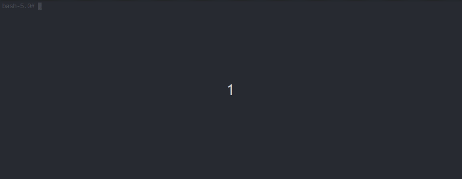

<p align="center">
  <big><strong>Cardano Addresses</strong></big>
</p>

<p align="center">
  <a href="https://github.com/IntersectMBO/cardano-addresses/releases" rel="nofollow"></a>
  <a href="https://IntersectMBO.github.io/cardano-addresses/haddock/index.html" rel="nofollow"></a>
  <a href="https://IntersectMBO.github.io/cardano-addresses/hpc_index.html" rel="nofollow"></a>
  <a href="https://intersectmbo.github.io/cardano-addresses/intro/" rel="nofollow"></a>
  <br />
</p>

<div align="center">

  <a href="">[](https://github.com/IntersectMBO/cardano-addresses/actions/workflows/coding-standards.yml)</a>
  <a href="">[](https://github.com/IntersectMBO/cardano-addresses/actions/workflows/haskell.yml)</a>
  <a href="">[](https://github.com/IntersectMBO/cardano-addresses/actions/workflows/docs.yml)</a>
  <a href="https://docusaurus.io/"></a>

</div>


## Overview

This module provides mnemonic (backup phrase) creation, and conversion of a
mnemonic to seed for wallet restoration, and address derivation functionalities.



## Documentation

### Haddock documentation

Haddock API documentation is available [here](https://IntersectMBO.github.io/cardano-addresses/haddock/index.html).

### Docusaurus-powered documentation

Powered by <a href="https://docusaurus.io/"></a>

CLI documentation is available [here](https://intersectmbo.github.io/cardano-addresses/command-line)

<details>
<summary><b>Ownership proving using ZKP (experimental)</b></summary>

> ⚠️ **Experimental.** The circuits, CLIs, and workflows below are developed in the
> [`cardano-foundation/bls`](https://github.com/cardano-foundation/bls) repository and are **not**
> part of the `cardano-addresses` release artifacts. The ceremonies used are single-party **dev**
> ceremonies — do **not** use them in production without a proper multi-party trusted setup. Expect
> breaking changes.

`cardano-addresses` derives the keys; it does not itself generate ZK proofs. Proving ownership of a
Cardano key with a zero-knowledge proof is provided by the
[`cardano-foundation/bls`](https://github.com/cardano-foundation/bls) project, which hosts the Circom
circuits and the Rust CLIs that drive them. The goal is to prove knowledge of the private Ed25519
scalar `sk` such that the public key `A = [sk]·G` matches a given compressed key — without ever
revealing `sk`. A real Cardano payment key is derived with `cardano-address` (CIP-1852 path
`1852H/1815H/0H/0/0`); in BIP32-Ed25519 the first 32 bytes of the extended signing key (`kL`) already
hold the clamped scalar the circuit needs as its private witness. The circuit is compiled once to
`.r1cs` + `.wasm` with `circom` on the BLS12-381 field and reused for any key — only the per-user
`input.json` changes. `snarkjs` turns `input.json` + `.wasm` into a witness, the
[`trusted-setup` CLI](https://github.com/cardano-foundation/bls/tree/main/clis/trusted-setup) runs a
single-party Groth16 ceremony, and the
[`groth16` CLI](https://github.com/cardano-foundation/bls/tree/main/clis/groth16) proves and verifies.
Two circuit families exist: `CardanoKeyOwnership` proves ownership of a single public key, while
`CardanoKeyOwnershipSMT` additionally proves that the key is a member of an authorized key set
committed into a Sparse Merkle Tree — so the verifier only trusts and stores the single Merkle root
instead of an `O(N)` key list. Both come in a monolithic (~1.97M constraints) and a Nova step-chain
variant that splits the scalar multiplication into 255 × 7.7K-constraint steps, cutting the ceremony
from ~8 minutes to ~3 seconds and the proving key from 1.2 GB to 5 MB. The pipeline is driven by
three Rust CLIs in `clis/` — `trusted-setup`, `smt`, and `nova` — which are described below.

#### The CLIs

All CLIs are Rust binaries in the
[`cardano-foundation/bls/clis`](https://github.com/cardano-foundation/bls/tree/main/clis) directory:

| CLI | Build | Purpose |
|-----|-------|---------|
| [`trusted-setup`](https://github.com/cardano-foundation/bls/tree/main/clis/trusted-setup) | `cd clis/trusted-setup && cargo build --release` | Groth16 trusted-setup ceremonies on BLS12-381: `ceremony-dev` (single-party dev ceremony, `--sparse` / `--h-scalar`) and `phase2` (multi-party MPC on a public `.ptau` SRS) |
| [`groth16`](https://github.com/cardano-foundation/bls/tree/main/clis/groth16) | `cd clis/groth16 && cargo build --release` | Proof generation (`prove`), verification (`verify`), and verifying-key export (`export-vk`) |
| [`smt`](https://github.com/cardano-foundation/bls/tree/main/clis/smt) | `cd clis/smt && cargo build --release` | Sparse Merkle Tree operations for `CardanoKeyOwnershipSMT`: `smt key` (Ed25519 decompression + limb chunking + MiMC leaf), `smt leaf`, `smt insert`, `smt digest`, `smt path`, `smt verify`, and `smt cardano-input` (full circuit-input assembly) |
| [`nova`](https://github.com/cardano-foundation/bls/tree/main/clis/nova) | `cd clis/nova && cargo build --release` | Nova IVC step-chain flow: `nova params`, `nova ceremony`, `nova fold`, `nova compress`, `nova verify` |

#### CardanoKeyOwnership — proving ownership of a single key

The circuit proves `A = PointCompress([sk]·G)` on Curve25519, where `sk` is the clamped scalar from
a real Cardano payment key and `A` its compressed public key.

```bash
BLS=<path-to-bls-repo>
cd $BLS/circom/CardanoKeyOwnership

# 1. Derive a real Cardano payment key
cardano-address recovery-phrase generate --size 15 > phrase.prv
cardano-address key from-recovery-phrase Shelley < phrase.prv > root.xsk
cardano-address key child 1852H/1815H/0H/0/0 < root.xsk > pay.xsk
cardano-address key public --without-chain-code < pay.xsk > pay.vk

# 2. Build the witness input (A, sk, PointA) from the bech32 keys
python3 gen_cardano_address_input.py --xsk pay.xsk --vk pay.vk -o input.json

# 3. Compile the circuit (once, reused for any key)
circom --prime bls12381 -l ../Ed25519Verify/node_modules/circomlib/circuits \
  cardano_ed25519_ownership.circom --r1cs --wasm --sym

# 4. Generate the witness
snarkjs wtns calculate \
  cardano_ed25519_ownership_js/cardano_ed25519_ownership.wasm \
  input.json witness_ownership.wtns

# 5. Single-party dev ceremony (once per circuit, ~8 min; --sparse --h-scalar required)
cd $BLS/clis/trusted-setup && cargo build --release
target/release/trusted-setup ceremony-dev --sparse --h-scalar \
  --circuit $BLS/circom/CardanoKeyOwnership/cardano_ed25519_ownership.r1cs \
  --proving-key cko.pk --verifying-key cko.vk

# 6. Prove
cd $BLS/clis/groth16
cargo run --release -- prove --sparse \
  --circuit $BLS/circom/CardanoKeyOwnership/cardano_ed25519_ownership.r1cs \
  --witness $BLS/circom/CardanoKeyOwnership/witness_ownership.wtns \
  --proving-key cko.pk --out proof.bin

# 7. Verify
cargo run --release -- verify \
  --proof proof.bin --public proof.pub --verifying-key cko.vk
# → Verification result: VALID
```

##### Nova step-chain variant (recommended for Ed25519)

The same statement can be split into 255 identical 7,724-constraint steps and folded with Nova
(Implementation 8). The ceremony drops to ~3 s and the proving key to 5 MB — at the cost of `O(N)`
verification and a sequential step chain.

```bash
cd $BLS/clis/nova && cargo build --release

cd $BLS/circom/CardanoKeyOwnership
circom --prime bls12381 -l ../Ed25519Verify/node_modules/circomlib/circuits \
  cardano_ed25519_ownership_nova.circom --r1cs --wasm --sym

# Inspect the step circuit (must report n_pub_in == n_pub_out == 24)
$BLS/clis/nova/target/release/nova params --circuit cardano_ed25519_ownership_nova.r1cs

# One ceremony for the step circuit (seconds, reusable)
$BLS/clis/nova/target/release/nova ceremony \
  --circuit cardano_ed25519_ownership_nova.r1cs \
  --proving-key cko255.pk --verifying-key cko255.vk

# Generate 255 step witnesses step_0000.wtns … step_0254.wtns iteratively
# (dblIn := extended(G), addIn := extended(O), sel := (sk >> i) & 1, LSB-first)
# via: snarkjs wtns calculate cardano_ed25519_ownership_nova_js/cardano_ed25519_ownership_nova.wasm

# Fold — prove each step, check the state chain, accumulate the transcript
$BLS/clis/nova/target/release/nova fold \
  --circuit cardano_ed25519_ownership_nova.r1cs \
  --proving-key cko255.pk --steps <witness-dir> --out cko255_ivc.json

# Verify — re-checks every pairing, the state chain, and the transcript
$BLS/clis/nova/target/release/nova verify --ivc cko255_ivc.json --verifying-key cko255.vk
# → Verified 255 steps: 255 pairings OK, state chain OK, transcript OK
```

#### CardanoKeyOwnershipSMT — set-based authorization with a Merkle root

The SMT variant combines Ed25519 key ownership with Sparse Merkle Tree membership: authorized public
keys are committed (as one-way MiMC leaves, never raw keys) into an SMT, and a single proof shows
that the prover owns `A` **and** that `A` is authorized by the tree root. The verifier stores only
the root, so the authorized-set state stays constant regardless of `N`. Key rotation and revocation
are root updates.

```bash
cd $BLS/clis/smt && cargo build --release

cd $BLS/circom/CardanoKeyOwnershipSMT

# Derive a real Cardano payment key (as above)
cardano-address recovery-phrase generate --size 15 > phrase.prv
cardano-address key from-recovery-phrase Shelley < phrase.prv > root.xsk
cardano-address key child 1852H/1815H/0H/0/0 < root.xsk > pay.xsk
cardano-address key public --without-chain-code < pay.xsk > pay.vk

# Build the full circuit input (A, sk, PointA, smt_root, siblings, directions);
# all crypto is done by the smt CLI, not by Python
./gen_input.sh --xsk pay.xsk --vk pay.vk --depth 4 --output input.json \
  --smt-cli $BLS/clis/smt/target/release/smt

# Compile, witness, ceremony, prove, verify — same shape as CardanoKeyOwnership,
# with cardano_key_ownership_smt.circom
circom --prime bls12381 -l ../Ed25519Verify/node_modules/circomlib/circuits \
  cardano_key_ownership_smt.circom --r1cs --wasm --sym
snarkjs wtns calculate cardano_key_ownership_smt_js/cardano_key_ownership_smt.wasm \
  input.json witness.wtns

$BLS/clis/trusted-setup/target/release/trusted-setup ceremony-dev --sparse --h-scalar \
  --circuit cardano_key_ownership_smt.r1cs --proving-key smt.pk --verifying-key smt.vk

cd $BLS/clis/groth16 && cargo build --release
target/release/groth16 prove --sparse \
  --circuit $BLS/circom/CardanoKeyOwnershipSMT/cardano_key_ownership_smt.r1cs \
  --witness $BLS/circom/CardanoKeyOwnershipSMT/witness.wtns \
  --proving-key smt.pk --out proof.bin
target/release/groth16 verify --proof proof.bin --public proof.pub --verifying-key smt.vk
# → Verification result: VALID
```

The SMT step-chain (Nova) variant `cardano_key_ownership_smt_nova.circom` folds the scalar
multiplication into 255 steps exactly as in the `CardanoKeyOwnership` Nova flow; the SMT-membership
half stays in the monolithic circuit.

#### CardanoKeyOwnership vs CardanoKeyOwnershipSMT

| Feature | CardanoKeyOwnership | CardanoKeyOwnershipSMT |
|---------|---------------------|------------------------|
| Proves key ownership | ✓ | ✓ |
| Proves set membership | ✗ | ✓ |
| Verifier trust / state | Per public key `A` | Single SMT root |
| Authorized set size | 1 | Any `N` (constant verification state) |
| Public inputs | `A[256]` | `A[256]`, `smt_root` |
| Hides which key | ✗ (`A` public) | ✗ (`A` public) — hides path/index only |
| Circuit size (monolithic) | 1,967,405 constraints | 1,971,079 constraints (+0.2 % at depth 4) |
| Circuit size (Nova) | 255 × 7,724 constraints | 255 × 7,724 constraints (SMT part stays monolithic) |
| Set rotation / revocation | n/a (per-key proof) | Root update (rebuild SMT) |
| Needs a key registry | ✗ | ✓ (root + Merkle path) |
| SMT CLI integration | ✗ | ✓ |

In short: use **CardanoKeyOwnership** to prove "I own this specific key `A`", and
**CardanoKeyOwnershipSMT** to prove "I own a key that is authorized in this set" — the set being
committed by a single Merkle root that the verifier must trust.

#### Implementation trade-offs: monolithic Groth16 vs Nova step-chain

Independently of the circuit family, the same statement can be proven as a single monolithic Groth16
proof (Implementation 7) or decomposed into 255 small steps and folded with Nova IVC (Implementation
8). The two paths have very different trade-offs, measured on the same machine with the same key:

| Phase | Monolithic Groth16 | Nova step-chain |
|---|---|---|
| Circuit | 1,967,405 constraints | 255 × 7,724 constraints |
| Witness generation | ~10 s | 255 steps: ~133 s (sequential) |
| Ceremony (one-time, reusable) | ~8 min | ~3 s |
| Prove / fold | ~74 s | ~179 s |
| Verify | ~1.5 s (one pairing) | ~3.2 s (255 pairings, `O(N)`) |
| **e2e first run (incl. ceremony)** | **~9.7 min** | **~5.2 min** |
| **e2e steady state (ceremony amortized)** | **~86 s** | **~312 s** |
| Proving key | 1.2 GB | 5 MB |
| Verifying key | 178 MB | 719 KB |
| Peak memory | ~4.5 GiB | per-step |

Takeaways:

- **First run — Nova wins.** The monolithic ceremony dominates (~8 min) and needs ~4.5 GiB of RAM,
  while the Nova ceremony is ~3 s and the fold uses per-step memory. The proving key shrinks from
  1.2 GB to 5 MB.
- **Steady state — monolithic Groth16 wins (~3.6×).** Once the ceremony is amortized, a new key
  costs ~86 s (one witness + one proof) vs ~312 s (255 step witnesses + fold). The step chain is
  inherently sequential — each step feeds the next — so it cannot be parallelized.
- **Verification.** The monolithic proof verifies with a single Groth16 pairing in ~1.5 s and is a
  standalone, constant-size artifact — the natural fit for on-chain verification. Nova verification
  is `O(N)`: it re-checks all 255 pairings plus the state chain and the transcript (~3.2 s), and the
  bundle grows linearly with the number of steps.
- **Deployment footprint.** Nova's ceremony is trivial but verification is not constant-time;
  Groth16's ceremony is heavy but is run once per circuit and then amortized across unlimited keys.
- **Both prove the same statement.** The point-compression and `addOut == 2·PointA` checks are done
  by the application outside the Nova fold; a single monolithic proof encodes them in-circuit.

Rule of thumb: **Nova** if you prove a fresh key once (or run on constrained hardware), **monolithic
Groth16** if you prove many keys against a pre-computed ceremony or need constant-size, cheap
on-chain verification.

#### Further reading

- [`CardanoKeyOwnership` reference](https://github.com/cardano-foundation/bls/tree/main/circom/CardanoKeyOwnership) — full end-to-end flows, Implementation 7 (monolithic) and Implementation 8 (Nova step-chain), plus benchmarks
- [`CardanoKeyOwnershipSMT` reference](https://github.com/cardano-foundation/bls/tree/main/circom/CardanoKeyOwnershipSMT) — SMT design, security considerations, and benchmarks
- [`trusted-setup` CLI](https://github.com/cardano-foundation/bls/tree/main/clis/trusted-setup) — ceremony commands (`ceremony-dev`, `phase2`)
- [`smt` CLI](https://github.com/cardano-foundation/bls/tree/main/clis/smt) — SMT operations and circuit-input generation
- [`nova` CLI](https://github.com/cardano-foundation/bls/tree/main/clis/nova) — Nova IVC step-chain and NIFS compression flow

Also available as a [dedicated documentation page](https://intersectmbo.github.io/cardano-addresses/zkp-ownership).

</details>

### Supported platforms

cardano-addresses is officially supported on the following operating systems:

- **Linux** - Ubuntu 20.04+, Debian 11+, Fedora 38+, and other major distributions
- **macOS** - version 11 (Big Sur) and later
- **Windows** - Windows 10 and Windows 11

cardano-addresses comes with CLI for Linux, MacOS and Windows. See [releases](https://github.com/IntersectMBO/cardano-addresses/releases) to get respective pre-compiled binaries. There is also straightforward way to [build Docker image](#docker-image).

## Building/testing from source using nix

Prerequisites: [Install Nix](https://nixos.org/download.html) with flakes enabled.

### Enter development shell

``` console
nix develop
```

Inside the development shell:

``` console
# building
cabal build all

# testing
cabal test cardano-addresses:unit

# installing executable locally
cabal install cardano-address
```

### Build using nix directly

``` console
# Build the Linux x86_64 binary
nix build .

# Run the built binary
./result/bin/cardano-address
```

### Building for different platforms

``` console
# Linux x86_64
nix build .

# Darwin x86_64
nix build .#packages.x86_64-darwin.default

# Darwin aarch64 (Apple Silicon)
nix build .#packages.aarch64-darwin.default

# Linux aarch64
nix build .#packages.aarch64-linux.default

# Linux x86_64 to Windows (cross-compilation)
nix build .#packages.x86_64-linux.default
```

### Building the Docker image

``` console
nix build .#packages.x86_64-linux.docker-image
docker load < result
```

## Override command for cross-compilation

We have now fixed cross-compilation (from Linux to Windows) by replacing runtime `git` call in `System.Git.TH` with CPP macro (ie., `GITREV`) defaulting to "unknown" but allowing overriding via `-DGITREV` as below:

```console
cabal build all --ghc-option=-DGITREV=\"$(git rev-parse HEAD)\"
```

## Preparation steps before uploading to hackage

``` console
cabal build all
cabal haddock
cabal sdist
```

Note: Make sure proper version is set in cardano-addresses.cabal

## Docker Image

Please make sure you have [just](https://github.com/casey/just) installed as `justfile` is used for building Docker image.

### Build

```console
just clean-build-docker
```

### Run

Use the auto-remove flag `--rm` when running commands.

```console
docker run --rm cardano-address recovery-phrase generate --size 15
```

Use the interactive flag `-i` when piping stdin:

```console
echo "addr1gqtnpvdhqrtpd4g424fcaq7k0ufuzyadt7djygf8qdyzevuph3wczvf2dwyx5u" | docker run --rm -i cardano-addresses address inspect
```

## Javascript support

Javascript support was discontinued and dropped. One could look at the following now:

1. [MeshJS](https://github.com/MeshJS/mesh)
2. [blaze-cardano](https://github.com/butaneprotocol/blaze-cardano)

Alternatively one could lean back on release [3.9.0](https://github.com/IntersectMBO/cardano-addresses/releases/tag/3.9.0) where Javascript was still present.

## WebAssembly

The library compiles to WebAssembly via GHC's WASM backend, producing a single `cardano-addresses.wasm` binary that runs in the browser or any WASI runtime.

### Build

```bash
nix build github:IntersectMBO/cardano-addresses#wasm
ls result/cardano-addresses.wasm   # 7.0MB
```

### Commands

The binary reads JSON from stdin and writes JSON to stdout. A `cmd` field selects the operation:

```bash
# Address inspection
echo '{"cmd":"inspect","address":"addr1..."}' | wasmtime result/cardano-addresses.wasm

# Key derivation (CIP-1852 Shelley)
# Hardened indexes can use the legacy 'H' suffix or the standard single-quote (') suffix.
# An optional 'm/' prefix denotes absolute derivation from the master key.
echo '{"cmd":"derive","mnemonic":"word1 word2 ...","path":"1852H/1815H/0H/0/0"}' | wasmtime result/cardano-addresses.wasm
# Equivalent with standard notation:
# echo '{"cmd":"derive","mnemonic":"word1 word2 ...","path":"m/1852'/1815'/0'/2/0"}' | wasmtime result/cardano-addresses.wasm

# Address construction
echo '{"cmd":"make-address","type":"enterprise","network":"testnet","payment_key":"hex..."}' | wasmtime result/cardano-addresses.wasm

# Ed25519 signing and verification
echo '{"cmd":"sign","key":"hex...","message":"hex..."}' | wasmtime result/cardano-addresses.wasm
echo '{"cmd":"verify","key":"hex...","message":"hex...","signature":"hex..."}' | wasmtime result/cardano-addresses.wasm

# Legacy bootstrap addresses (Byron/Icarus)
echo '{"cmd":"bootstrap-address","style":"icarus-from-mnemonic","protocol_magic":764824073,...}' | wasmtime result/cardano-addresses.wasm
```

### Browser integration

Use [@bjorn3/browser_wasi_shim](https://www.npmjs.com/package/@bjorn3/browser_wasi_shim) to run the WASM binary client-side:

```javascript
import { WASI, File, OpenFile, ConsoleStdout } from "@bjorn3/browser_wasi_shim";

const mod = await WebAssembly.compile(await (await fetch("cardano-addresses.wasm")).arrayBuffer());

async function call(input) {
  let out = "";
  const fds = [
    new OpenFile(new File(new TextEncoder().encode(input))),
    ConsoleStdout.lineBuffered(l => out += l + "\n"),
    ConsoleStdout.lineBuffered(() => {}),
  ];
  const wasi = new WASI([], [], fds, { debug: false });
  wasi.start(await WebAssembly.instantiate(mod, { wasi_snapshot_preview1: wasi.wasiImport }));
  return JSON.parse(out.trim());
}
```

Benchmarked: ~9ms compile (one-time), ~3ms per Shelley call, ~13ms for legacy.

A live demo is available at: https://IntersectMBO.github.io/cardano-addresses/browser/

### Nix integration

Downstream flakes consume the WASM as a package:

```nix
{
  inputs.cardano-addresses.url = "github:IntersectMBO/cardano-addresses";

  outputs = { cardano-addresses, ... }: {
    packages.wasm = cardano-addresses.packages.x86_64-linux.wasm;
    # result/cardano-addresses.wasm
  };
}
```

## Contributing

Pull requests are welcome.

When creating a pull request, please make sure that your code adheres to our [coding standards](https://input-output-hk.github.io/adrestia/code/Coding-Standards).
<hr />

<p align="center">
  <a href="https://github.com/IntersectMBO/cardano-addresses/blob/master/LICENSE"></a>
</p>

